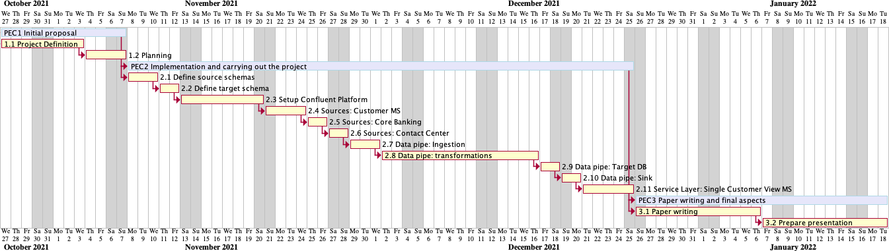
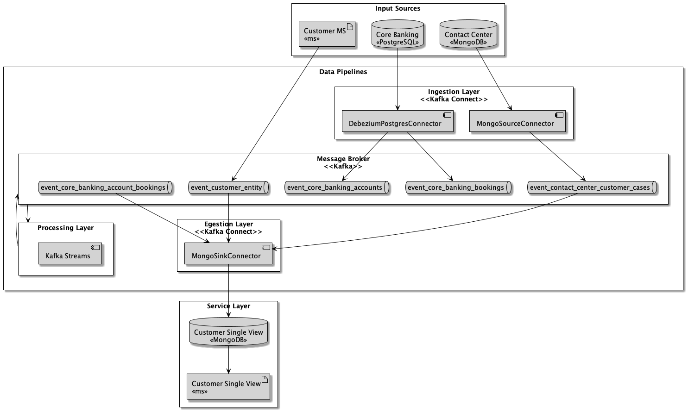
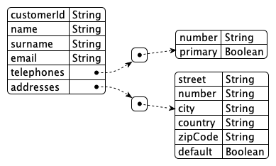
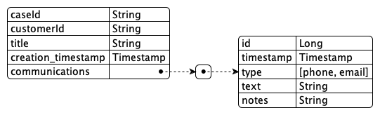
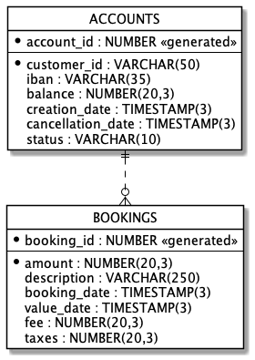

# Single Customer View

## :calendar: Project Planning

Gantt Diagram




## System Design



## :framed_picture: Environment Setup

2 options

* [Docker Compose](docker-compose/README.md)
* [K8S-Terraform](k8s-terraform/README.md)

## :gear: Build

Build modules (datagen, account-bookings-kafka-streams and service)

```shell
docker-compose -p tfm \
-f docker-compose.confluent.yml \
-f docker-compose.confluent.changes.yml \
-f docker-compose.yml \
build
```

## :running_man: Run

Start environment

```shell
docker-compose -p tfm \
-f docker-compose.confluent.yml \
-f docker-compose.confluent.changes.yml \
-f docker-compose.yml \
up -d
```

## :white_check_mark: Test

Control center accessible through the following URL: http://localhost:9021/

Test the service layer:

```shell
# list all customers
curl -vvv http://localhost:8080/api/customers | jq
# store a sample customer_id
CUSTOMER_ID="`curl -vvv http://localhost:8080/api/customers | jq -r '.data[0].customer_id'`"
echo "${CUSTOMER_ID}"
# get the customer (only basic info)
curl -vvv "http://localhost:8080/api/customers/${CUSTOMER_ID}" | jq
# get the customer detail (with cases and accounts)
curl -vvv "http://localhost:8080/api/customers/${CUSTOMER_ID}/detail" | jq
```


## :open_book: Data Definition

Sources:

Customer MS (Kafka Events - AVRO)



See: [source](schemas/customer-value.avsc)

Contact Center (Mongo DB - BSON)



See: [source](schemas/contact-center-case-json-schema.json)

Core Banking (Postgresql - DDL)




See: [source](schemas/core-banking.ddl)
