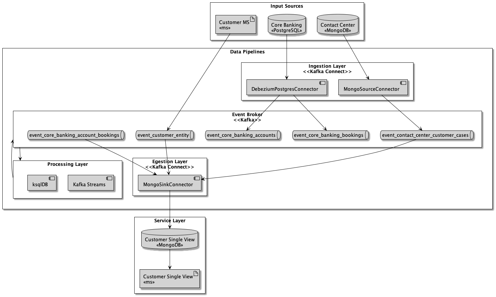
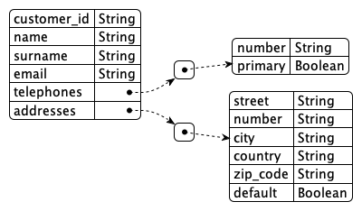
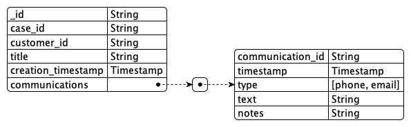
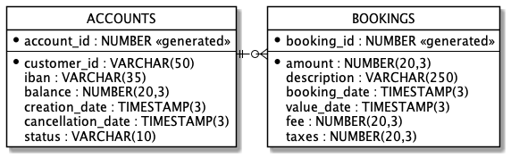

# Customer Single View

## Project Planning

Gantt Diagram


## System Design



## Environment Setup

2 Options:

* [Docker Compose](docker-compose/README.md)
* [K8S-Terraform](k8s-terraform/README.md)
## Test


## :white_check_mark: Test

```shell
curl -vvv http://localhost:8080/api/customers | jq
CUSTOMER_ID="`curl -vvv http://localhost:8080/api/customers | jq -r '.data[0].customer_id'`"
# CUSTOMER_ID="doris.veum"
echo "${CUSTOMER_ID}"
curl -vvv "http://localhost:8080/api/customers/${CUSTOMER_ID}" | jq
curl -vvv "http://localhost:8080/api/customers/${CUSTOMER_ID}/detail" | jq

```


## Data Definition

Sources:

Customer MS (Kafka Events - AVRO)



See: [source](schemas/customer-value.avsc)

Contact Center (Mongo DB - BSON)



See: [source](schemas/contact-center-case-json-schema.json)

Core Banking (Postgresql - DDL)




See: [source](schemas/core-banking.ddl)