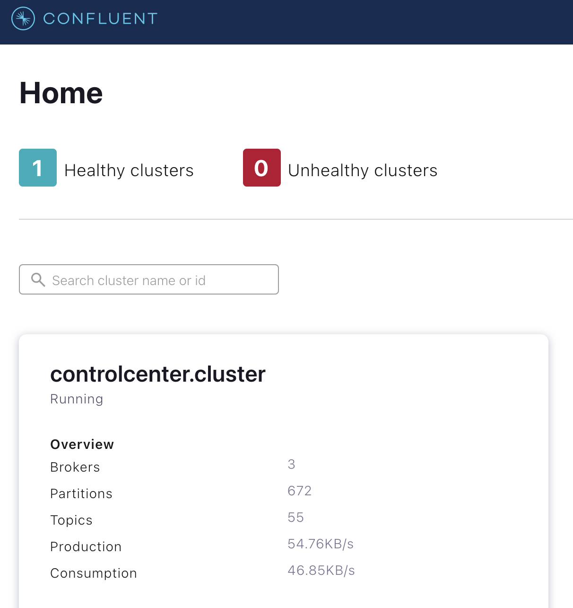

# Install Confluent Platform

## Prerequisites

* Install common tools: [Install common tools](INSTALL-COMMON-TOOLS.md)
* K8S: [Create K8S cluster](K8S-CREATE-CLUSTER.md)
* Terraform: [Install terraform](INSTALL-TERRAFORM.md)

## Setup initial cluster

Configure terraform
```shell
cd terraform

# See: https://learn.hashicorp.com/tutorials/terraform/kubernetes-provider
export k8s_name="kind-data-lake"
export k8s_host=`kubectl config view -o json | jq -r --arg clusterName "${k8s_name}" '.clusters[] | select(.name == $clusterName) | .cluster.server'`
export k8s_cluster_ca_certificate=`kubectl config view --flatten -o json | jq -r --arg clusterName "${k8s_name}" '.clusters[] | select(.name == $clusterName) | .cluster["certificate-authority-data"]'`
export k8s_client_certificate=`kubectl config view --flatten -o json | jq -r --arg userName "${k8s_name}" '.users[] | select(.name == $userName) | .user["client-certificate-data"]'`
export k8s_client_key=`kubectl config view --flatten -o json | jq -r --arg userName "${k8s_name}" '.users[] | select(.name == $userName) | .user["client-key-data"]'`
export k8s_project_label="customer-single-view"
export k8s_namespace="customer-single-view"

cat > terraform.tfvars << EOF
# variables.tf

k8s_host                   = "${k8s_host}"
k8s_client_certificate     = "${k8s_client_certificate}"
k8s_client_key             = "${k8s_client_key}"
k8s_cluster_ca_certificate = "${k8s_cluster_ca_certificate}"
k8s_project_label          = "${k8s_project_label}"
k8s_namespace              = "${k8s_namespace}"

EOF
```

Debug a chart
```shell
helm repo add confluentinc https://confluentinc.github.io/cp-helm-charts/ 
helm repo update
helm install cp-helm-charts-debug confluentinc/cp-helm-charts --dry-run --debug --version 0.6.1 -f debug-values.yml
```

Run terraform
```shell
terraform apply -var-file terraform.tfvars

# to delete all infra
terraform destroy
```

Read logs
```shell
export k8s_namespace="customer-single-view"

export k8s_app_name="cp-control-center"
export k8s_pod_container="cp-control-center"

# export k8s_app_name="cp-kafka"
# export k8s_pod_container="ccp-kafka-broker"

# export k8s_app_name="cp-kafka-connect"
# export k8s_pod_container="cp-kafka-connect-server"

# control center
export POD_NAME=$(kubectl -n ${k8s_namespace} get pods -l "app=${k8s_app_name}" -o jsonpath="{.items[0].metadata.name}")
echo "${k8s_app_name} => ${POD_NAME}(${k8s_pod_container})"
kubectl -n ${k8s_namespace} get pods -l "app=${k8s_app_name}" -o jsonpath="{.items[0].spec.containers[*].name}"

# Follow log
kubectl -n ${k8s_namespace} logs ${POD_NAME} ${k8s_pod_container} --follow
# Store
kubectl -n ${k8s_namespace} logs ${POD_NAME} ${k8s_pod_container} --follow | tee -a "${POD_NAME}_${k8s_pod_container}_`date +%d_%m_%Y-%H_%M`.log" 

```

Port forward
```shell
export k8s_namespace="customer-single-view"
export app_cp_control_center="cp-control-center"
export app_cp_kafka="cp-kafka"
export app_cp_kafka_connect="cp-kafka-connect"

export CONTROL_CENTER_SERVICE_NAME=$(kubectl -n ${k8s_namespace} get services -l "app=${app_cp_control_center}" -o jsonpath="{.items[0].metadata.name}")
export KAFKA_SERVICE_NAME=$(kubectl -n ${k8s_namespace} get services -l "app=${app_cp_kafka}" -o jsonpath="{.items[0].metadata.name}")
export KAFKA_CONNECT_SERVICE_NAME=$(kubectl -n ${k8s_namespace} get services -l "app=${app_cp_kafka_connect}" -o jsonpath="{.items[0].metadata.name}")
export MONGODB_SERVICE_NAME="mongodb"
export POSTGRESQL_SERVICE_NAME="postgresql"

# Explore ports
kubectl -n ${k8s_namespace} get services ${CONTROL_CENTER_SERVICE_NAME} -o jsonpath="{.spec.ports}"
kubectl -n ${k8s_namespace} get services ${KAFKA_SERVICE_NAME} -o jsonpath="{.spec.ports}"
kubectl -n ${k8s_namespace} get services ${KAFKA_CONNECT_SERVICE_NAME} -o jsonpath="{.spec.ports}"
# manual forwarding
#kubectl -n ${k8s_namespace} port-forward service/${CONTROL_CENTER_SERVICE_NAME} 9021:cc-http
#kubectl -n ${k8s_namespace} port-forward service/${KAFKA_SERVICE_NAME} 9092:broker

kubepfm <<EOF
ns=${k8s_namespace}:service/${CONTROL_CENTER_SERVICE_NAME}:9021:cc-http
ns=${k8s_namespace}:service/${KAFKA_SERVICE_NAME}:9092:broker
EOF

```

Access to control center [here](http://localhost:9021) 





## See
* https://confluentinc.github.io/cp-helm-charts/